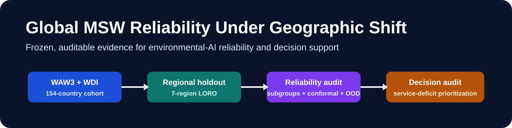

<p align="center">
  
</p>

<h1 align="center">Global MSW Reliability Under Geographic Shift</h1>

<p align="center">
  <strong>Reproducibility companion for</strong><br>
  <em>Reliability Gaps Under Geographic Shift in Global Municipal Waste Service Prediction</em>
</p>

<p align="center">
  <a href="https://github.com/SunilgarGusai/global-msw-reliability-under-shift/actions/workflows/repository-validation.yml"></a>
  <a href="https://github.com/SunilgarGusai/global-msw-reliability-under-shift/releases/tag/v1.0.0-submission"></a>
  
  <a href="environment.yml"></a>
  <a href="CITATION.cff"></a>
  <a href="LICENSE"></a>
</p>

<p align="center">
  <a href="#overview">Overview</a> •
  <a href="#study-workflow">Workflow</a> •
  <a href="#reproduce-and-verify">Reproduce</a> •
  <a href="#reviewer-navigation">Reviewer map</a> •
  <a href="#repository-scope">Scope</a> •
  <a href="#citation">Citation</a>
</p>

---

## Overview

This repository accompanies a reliability-first study of **global municipal solid-waste service prediction under geographic distribution shift**. The emphasis is not on building a larger model leaderboard. It is on asking whether seemingly useful predictions remain dependable when transferred to unseen regions, audited across policy-relevant subgroups, paired with uncertainty estimates, and used for service-deficit prioritization.

The analysis combines **World Bank What a Waste 3.0 / Data360 evidence** with **World Development Indicators**, evaluates transfer with leave-one-region-out validation, and preserves the complete computational path needed to inspect the frozen results.

> **Core idea:** predictive accuracy is only one layer of evidence. Geographic transfer, subgroup reliability, uncertainty behaviour, and decision consequences must be audited separately.

### Four reliability lenses

**Geographic transfer** — each World Bank region is held out in turn so the test data come from a region unseen during fitting.

**Subgroup reliability** — errors and signed bias are audited across income groups, regions, measurement bases, and recency slices.

**Uncertainty under shift** — conformal coverage and covariate-distance diagnostics are evaluated under deliberate geographic distribution shift.

**Decision consequences** — frozen out-of-fold predictions are examined for how well they identify and rank severe service deficits.

Detailed numerical results are intentionally kept out of this landing page. They are preserved in [`docs/FROZEN_RESULTS.md`](docs/FROZEN_RESULTS.md) and the machine-readable files under [`results/`](results/).

## Study workflow

<p align="center">
  
</p>

<p align="center">
  <sub>Animated path highlighting is decorative; the scientific workflow is unchanged. <a href="figures/Fig1_Workflow_V2.svg">Open the static publication workflow SVG</a>.</sub>
</p>

The computational design is frozen in [`docs/METHOD_PROTOCOL.md`](docs/METHOD_PROTOCOL.md), while [`config/frozen_config.json`](config/frozen_config.json) records the public analysis configuration.

## Reproduce and verify

The fastest reviewer-facing route verifies the committed manuscript-producing evidence without depending on mutable upstream APIs:

```bash
python -m pip install -r requirements.txt
python scripts/validate_public_artifact.py
pytest -q
python scripts/summarize_key_results.py
```

The continuous-integration workflow repeats the structural and numerical checks in a clean GitHub runner and also replays the V2 decision audit from the frozen out-of-fold predictions.

For a deterministic V2 replay:

```bash
python pipeline/scripts/11_oof_decision_audit.py \
  --predictions results/verified_baseline/results/primary_logo_predictions.csv \
  --out results/v2_upgrade_reproduced \
  --figures figures/reproduced
```

For fresh source acquisition and a complete rerun, use the phase-separated launchers in [`pipeline/cmd/`](pipeline/cmd/). Because upstream public datasets can be revised, fresh retrieval is scientifically useful but is not expected to be byte-identical to the frozen reproducibility state.

See [`QUICKSTART.md`](QUICKSTART.md) and [`docs/REPRODUCIBILITY.md`](docs/REPRODUCIBILITY.md).

## Reviewer navigation

<table>
<tr>
<td width="50%" valign="top">

### Method & design
Start with [`docs/METHOD_PROTOCOL.md`](docs/METHOD_PROTOCOL.md) for the computational protocol, validation structure, model family, uncertainty design, and audit logic.

### Data provenance
Use [`docs/DATA_PROVENANCE.md`](docs/DATA_PROVENANCE.md) and [`DATA_SOURCES.md`](DATA_SOURCES.md) for source lineage, acquisition routes, and reproducibility boundaries.

### Claim boundaries
[`docs/CLAIM_BOUNDARIES.md`](docs/CLAIM_BOUNDARIES.md) states explicitly what the frozen evidence supports and what it does not support.

</td>
<td width="50%" valign="top">

### Frozen evidence
[`docs/FROZEN_RESULTS.md`](docs/FROZEN_RESULTS.md) gives the manuscript-facing numerical evidence; the underlying CSV/JSON files are in [`results/`](results/).

### Integrity & traceability
[`TRACEABILITY.csv`](TRACEABILITY.csv), [`REPOSITORY_MANIFEST.csv`](REPOSITORY_MANIFEST.csv), and [`PUBLIC_SHA256SUMS.txt`](PUBLIC_SHA256SUMS.txt) link claims, files, and checksums.

### Release state
[`docs/RESULTS_FREEZE.md`](docs/RESULTS_FREEZE.md) and [`docs/RELEASE_POLICY.md`](docs/RELEASE_POLICY.md) describe the frozen submission state and versioning policy.

</td>
</tr>
</table>

<details>
<summary><strong>Repository structure</strong></summary>

```text
.
├── .github/workflows/          # automated repository verification
├── config/                     # frozen public configuration
├── docs/                       # methods, provenance, claim boundaries, freeze notes
│   └── assets/                 # repository banner
├── figures/                    # publication-quality scientific figures
├── pipeline/
│   ├── cmd/                    # phase-separated Windows launchers
│   └── scripts/                # analysis and V2 decision-audit code
├── provenance/                 # Phase-B2 lock, verification report, historical manifests
├── results/
│   ├── verified_baseline/      # frozen predictions, tables and execution logs
│   └── v2_upgrade/             # reviewer-stage decision audit
├── scripts/                    # public validation and summary helpers
├── tests/                      # frozen numerical-invariant tests
├── CITATION.cff
├── QUICKSTART.md
├── REPOSITORY_MANIFEST.csv
├── PUBLIC_SHA256SUMS.txt
├── THIRD_PARTY_LICENSES.md
├── environment.yml
└── requirements.txt
```

</details>

## Repository scope

This is a **scientific reproducibility repository**, not a mirror of the private manuscript package.

**No manuscript source or manuscript PDF is stored here.** The repository does not contain the manuscript, blinded/unblinded manuscript files, cover letter, title page, or other portal-specific manuscript material.

The only PDFs in the repository are **scientific figure files** corresponding to the figures under [`figures/`](figures/). The versioned release asset contains the same reproducibility package and likewise excludes manuscript and journal-administrative files.

## Scientific boundaries

This work is a country-scale predictive-reliability and decision-support audit. It is not a causal study, a deployed allocation system, or evidence that every uncertainty or abstention strategy must fail.

The complete supported/unsupported claim boundary is maintained in [`docs/CLAIM_BOUNDARIES.md`](docs/CLAIM_BOUNDARIES.md), rather than repeated here.

## Data and licensing

Original World Bank/Data360 and World Development Indicators materials retain their upstream terms. This repository does not relicense those sources. It provides acquisition code, source lineage, frozen derived analytical outputs, and integrity metadata needed to audit the published analysis.

Original project code and documentation are released under the [`MIT License`](LICENSE). Third-party notices are collected in [`THIRD_PARTY_LICENSES.md`](THIRD_PARTY_LICENSES.md).

## Frozen release

The frozen reproducibility archive is preserved as:

**[`v1.0.0-submission`](https://github.com/SunilgarGusai/global-msw-reliability-under-shift/releases/tag/v1.0.0-submission)**

Scientific corrections should receive a new release version rather than silently replacing the frozen state.

## Authors

**Sunilgar L. Gusai** — corresponding author, Faculty of Computer Applications, Marwadi University  
ORCID: [0009-0004-0739-4812](https://orcid.org/0009-0004-0739-4812)

**Manoharsinh R. Jadeja** — Department of Artificial Intelligence, Machine Learning and Data Science, Marwadi University  
ORCID: [0000-0003-1833-4730](https://orcid.org/0000-0003-1833-4730)

## Citation

Machine-readable citation metadata are provided in [`CITATION.cff`](CITATION.cff). Until the associated article receives final bibliographic metadata, cite the repository by title, authors, repository URL, and frozen release tag.

---

<p align="center">
  <strong>Reliability first · geographically aware validation · auditable evidence · reproducible decision analysis</strong>
</p>
