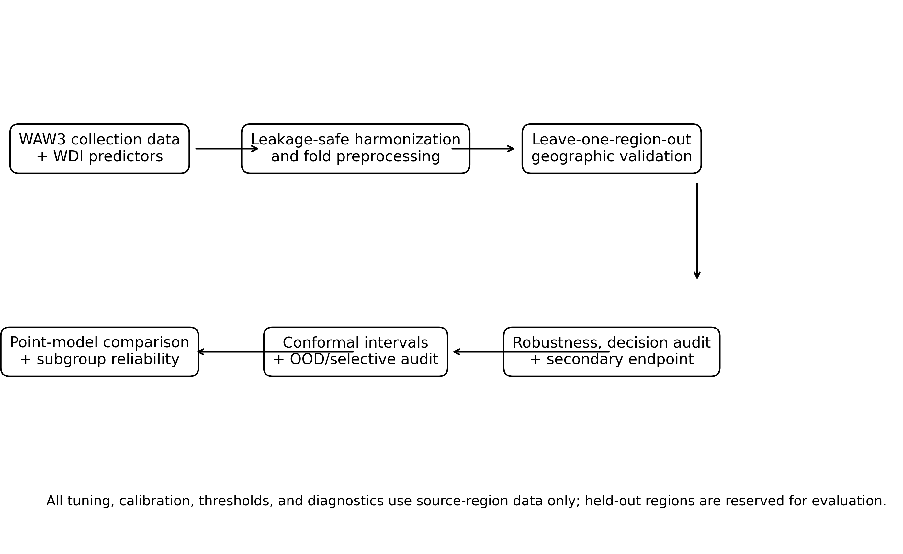

<p align="center">
  
</p>

<h1 align="center">Global MSW Reliability Under Geographic Shift</h1>

<p align="center"><strong>Reproducibility companion for “Reliability Gaps Under Geographic Shift in Global Municipal Waste Service Prediction”</strong></p>

<p align="center">
  <a href="https://github.com/SunilgarGusai/global-msw-reliability-under-shift/actions/workflows/repository-validation.yml"></a>
  <a href="environment.yml"></a>
  <a href="results/verified_baseline/results/primary_logo_predictions.csv"></a>
  <a href="docs/FROZEN_RESULTS.md"></a>
  <a href="CITATION.cff"></a>
  <a href="LICENSE"></a>
  
</p>

<p align="center">
  <a href="#study-at-a-glance">Study</a> •
  <a href="#key-evidence">Evidence</a> •
  <a href="#reproducibility">Reproducibility</a> •
  <a href="#reviewer-map">Reviewer map</a> •
  <a href="#release-policy">Release policy</a>
</p>

---

## Why this repository?

Country-scale environmental prediction can look acceptable in aggregate while failing systematically where service deficits are most severe. This repository exposes the frozen calculations, out-of-fold predictions, uncertainty diagnostics, subgroup audits, decision-prioritization checks, code, provenance, and integrity tests behind a global municipal-solid-waste collection study using World Bank *What a Waste 3.0* and World Development Indicators.

> **Central question:** Does apparent predictive usefulness survive geographic exclusion, subgroup reliability auditing, uncertainty calibration checks, and direct service-deficit prioritization analysis?

The repository deliberately preserves negative and cautionary findings. In particular, nonlinear models do not materially improve geographic transfer over ordinary linear regression; nominal conformal coverage deteriorates sharply in low-income countries; Mahalanobis covariate distance is almost unrelated to realized absolute error; and ranking performance can look strong while still missing many of the most severe service deficits.

## Study at a glance

| Component | Frozen design |
|---|---:|
| Primary countries | **154** |
| Geographic validation | **7** World Bank regions, leave-one-region-out |
| Primary endpoint | National regular MSW collection coverage |
| Core predictors | GDP per capita (PPP), urbanization, population, population density |
| Point models | Linear, ridge, random forest, histogram gradient boosting, mean baseline |
| Uncertainty | 90% split conformal, OOD-scaled, income-Mondrian diagnostic |
| Selective score | Mahalanobis distance in transformed predictor space |
| Bootstrap replicates | **20,000** |
| V2 decision audit | Outcome severity + service-deficit prioritization from frozen LORO predictions |
| Primary seed | **19019** |

See [`docs/METHOD_PROTOCOL.md`](docs/METHOD_PROTOCOL.md) for the complete computational design.

## Key evidence

| Evidence | Frozen result | Interpretation |
|---|---:|---|
| Linear LORO MAE | **13.98** percentage points | Best primary point model by pooled LORO MAE |
| Linear LORO RMSE | **18.91** | Geographic transfer remains imperfect |
| Linear LORO R² | **0.563** | Socioeconomic predictors contain substantial out-of-region signal |
| Low-income MAE | **25.47** | Error is much larger in the lowest-income stratum |
| High-income MAE | **6.46** | Aggregate performance masks subgroup disparity |
| Low-income mean signed error | **+17.70** | Collection coverage is systematically overestimated |
| Nominal-90% conformal coverage, overall | **85.1%** | Undercoverage appears under geographic shift |
| Nominal-90% conformal coverage, low income | **53.8%** | Severe subgroup calibration failure |
| OOD score vs absolute error | **Spearman ρ = 0.035** | Covariate distance does not rank realized failures well |
| Lowest-coverage quartile MAE | **23.72** | Errors concentrate where observed service coverage is lowest |
| Deficit-rank Spearman | **0.807** | Overall ranking correspondence is strong |
| Recall of worst 10% true deficits | **37.5%** | Strong rank correlation does not guarantee capture of the most severe deficits |

Detailed estimates, confidence intervals, subgroup counts, and source files are listed in [`docs/FROZEN_RESULTS.md`](docs/FROZEN_RESULTS.md).

## Method at a glance

<p align="center">
  
</p>

The primary evaluation is a **leave-one-World-Bank-region-out** design. All preprocessing and model selection are fitted within source-region data. Reliability is then audited by region, income group, observation recency, measurement basis, uncertainty coverage, selective retention, outcome severity, and service-deficit prioritization.

## Reproducibility

This repository supports two distinct levels of reproducibility.

### 1. Exact verification of the manuscript-producing state — no network required

```bash
python -m pip install -r requirements.txt
python scripts/validate_public_artifact.py
pytest -q
python scripts/summarize_key_results.py
```

The committed prediction arrays and tables are the frozen manuscript-facing evidence. They are independently checked against numerical invariants and the repository manifest.

### 2. Reproduce the V2 decision audit from frozen LORO predictions

```bash
python pipeline/scripts/11_oof_decision_audit.py \
  --predictions results/verified_baseline/results/primary_logo_predictions.csv \
  --out results/v2_upgrade_reproduced \
  --figures figures/reproduced
```

This rerun performs **no model fitting**. It uses the frozen ordinary-linear-regression out-of-fold predictions and seed `19019` with 20,000 bootstrap replicates. A clean replay has been verified to reproduce all seven V2 audit CSVs exactly.

### 3. Fresh source acquisition and full pipeline replay

The original phase-separated Windows launchers remain under [`pipeline/cmd/`](pipeline/cmd/). A fresh run depends on the continued availability and current content of World Bank/Data360 and WDI endpoints. Because upstream public sources can be revised retrospectively, a future fresh download is not expected to be byte-identical to the September 2026 source snapshot. For exact article verification, use the frozen out-of-fold predictions and machine-readable tables committed here.

See [`QUICKSTART.md`](QUICKSTART.md) and [`docs/REPRODUCIBILITY.md`](docs/REPRODUCIBILITY.md).

## Reviewer map

| Need | Start here |
|---|---|
| Full computational design | [`docs/METHOD_PROTOCOL.md`](docs/METHOD_PROTOCOL.md) |
| Headline frozen evidence | [`docs/FROZEN_RESULTS.md`](docs/FROZEN_RESULTS.md) |
| Data provenance and source URLs | [`docs/DATA_PROVENANCE.md`](docs/DATA_PROVENANCE.md) |
| Exact vs fresh-retrieval reproducibility | [`docs/REPRODUCIBILITY.md`](docs/REPRODUCIBILITY.md) |
| Scientific claim limits | [`docs/CLAIM_BOUNDARIES.md`](docs/CLAIM_BOUNDARIES.md) |
| Scientific freeze statement | [`docs/RESULTS_FREEZE.md`](docs/RESULTS_FREEZE.md) |
| Claim-to-file traceability | [`TRACEABILITY.csv`](TRACEABILITY.csv) |
| Curated repository inventory | [`REPOSITORY_MANIFEST.csv`](REPOSITORY_MANIFEST.csv) |
| Frozen configuration | [`config/frozen_config.json`](config/frozen_config.json) |
| V2 decision audit | [`pipeline/scripts/11_oof_decision_audit.py`](pipeline/scripts/11_oof_decision_audit.py) |
| Automated integrity checks | [`scripts/validate_public_artifact.py`](scripts/validate_public_artifact.py) and [`tests/`](tests/) |

## Result-to-source map

| Manuscript-facing result | Machine-readable source |
|---|---|
| Point-model comparison | [`primary_model_summary.csv`](results/verified_baseline/tables/primary_model_summary.csv) |
| Region/income reliability | [`primary_subgroup_metrics.csv`](results/verified_baseline/tables/primary_subgroup_metrics.csv) |
| Primary LORO predictions | [`primary_logo_predictions.csv`](results/verified_baseline/results/primary_logo_predictions.csv) |
| Conformal/OOD predictions | [`primary_conformal_predictions.csv`](results/verified_baseline/results/primary_conformal_predictions.csv) |
| Selective-prediction summary | [`conformal_selective_summary.csv`](results/verified_baseline/tables/conformal_selective_summary.csv) |
| Robustness analyses | [`primary_robustness_summary.csv`](results/verified_baseline/tables/primary_robustness_summary.csv) |
| Treatment/disposal secondary endpoint | [`secondary_model_summary.csv`](results/verified_baseline/tables/secondary_model_summary.csv) |
| Outcome-severity audit | [`v2_target_severity_audit.csv`](results/v2_upgrade/v2_target_severity_audit.csv) |
| Error–severity correlations | [`v2_target_error_correlations.csv`](results/v2_upgrade/v2_target_error_correlations.csv) |
| Deficit-ranking performance | [`v2_prioritization_rank_metrics.csv`](results/v2_upgrade/v2_prioritization_rank_metrics.csv) |
| Threshold-level missed deficits | [`v2_service_deficit_threshold_audit.csv`](results/v2_upgrade/v2_service_deficit_threshold_audit.csv) |

## Repository structure

```text
.
├── .github/workflows/          # automated repository verification
├── config/                     # frozen public configuration
├── docs/                       # method, evidence, provenance, claim boundaries
│   └── assets/                 # repository banner
├── figures/                    # manuscript-facing and reproducible figures
├── pipeline/
│   ├── cmd/                    # original Windows phase launchers
│   └── scripts/                # original analysis + V2 decision audit
├── provenance/                 # original Phase-B2 lock, manifest and checksums
├── results/
│   ├── verified_baseline/      # frozen predictions/tables/logs
│   └── v2_upgrade/             # reviewer-stage decision audit
├── scripts/                    # public verification/summary helpers
├── tests/                      # frozen numerical-invariant tests
├── CITATION.cff
├── QUICKSTART.md
├── REPOSITORY_MANIFEST.csv
├── PUBLIC_SHA256SUMS.txt
├── THIRD_PARTY_LICENSES.md
├── environment.yml
└── requirements.txt
```

## Scientific scope and limitations

This is a **country-scale predictive-reliability and decision-support audit**, not a deployed municipal-waste allocation system and not a causal study of development or waste-service provision.

Important boundaries include:

- the primary endpoint mixes MSW-weight, population-served, and household-served measures under an explicit precedence rule;
- observations span 2001–2025, while income groups are current-policy audit strata rather than historical causal labels;
- World Bank regions provide a coarse geographic-shift definition;
- North America has only two observations and is descriptive only;
- conformal intervals are evaluated under deliberate geographic distribution shift and are not claimed to retain exchangeability guarantees;
- Mahalanobis distance is only one OOD score, so its failure is not evidence that all abstention or uncertainty methods fail;
- the V2 decision audit evaluates the already-frozen LORO predictions and does not refit or retune the model;
- service-deficit ranking diagnostics illustrate prioritization consequences but do not model actual funding allocation, local implementation, or causal benefit.

See [`docs/CLAIM_BOUNDARIES.md`](docs/CLAIM_BOUNDARIES.md).

## Public data policy

Original World Bank/Data360 and World Development Indicators data are not relicensed by this repository. Source providers retain their own terms. The repository provides source URLs, acquisition code, source lineage, frozen derived predictions/tables, and integrity metadata. See [`docs/DATA_PROVENANCE.md`](docs/DATA_PROVENANCE.md) and [`THIRD_PARTY_LICENSES.md`](THIRD_PARTY_LICENSES.md).

## Release policy

This repository is maintained as the public reproducibility companion for the study. The scientific state supporting the submission is frozen under a versioned release so that later documentation or publication-metadata updates do not alter the evidence used for the manuscript.

The intended immutable submission-state tag is:

```text
v1.0.0-submission
```

Any later correction that changes scientific content should receive a new release version rather than altering the frozen tag.

## Authors

- **Sunilgar L. Gusai** — corresponding author, Faculty of Computer Applications, Marwadi University; ORCID: [0009-0004-0739-4812](https://orcid.org/0009-0004-0739-4812)
- **Manoharsinh R. Jadeja** — Department of Artificial Intelligence, Machine Learning and Data Science, Marwadi University; ORCID: [0000-0003-1833-4730](https://orcid.org/0000-0003-1833-4730)

## Citation

Citation metadata are supplied in [`CITATION.cff`](CITATION.cff). Until the article receives final bibliographic metadata, cite the repository by title, authors, URL, and frozen release tag.

## License

Original project code and documentation are released under the [`MIT License`](LICENSE). World Bank and other third-party materials retain their upstream terms; see [`THIRD_PARTY_LICENSES.md`](THIRD_PARTY_LICENSES.md).
